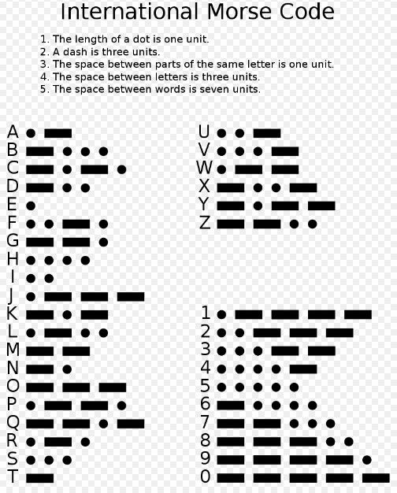

<a name="readme-top"></a>
<div align="center">  
  <h2><b>Ruby Methods to Decode a Morse Message</b></h2>
</div>
<div align="center">
  
</div>

# 📗 Table of Contents

- [📖 About the Project](#about-project)
  - [🛠 Built With](#built-with)
    - [Tech Stack](#tech-stack)
    - [Key Features](#key-features)
  <!-- - [🚀 Live Demo](#live-demo) -->
- [💻 Getting Started](#getting-started)
  - [Setup](#setup)
  - [Prerequisites](#prerequisites)
  - [Install](#install)
  - [Usage](#usage)
  <!-- - [Run tests](#run-tests) -->
  <!-- - [Deployment](#triangular_flag_on_post-deployment) -->
- [👥 Authors](#authors)
- [🤝 Contributing](#contributing)
- [⭐️ Show your support](#support)
- [🔭 Acknowledgements](#acknowledgements)
- [📝 License](#license)

<!-- PROJECT DESCRIPTION -->

# 🎯 Decode a Morse Code<a name="about-project"></a>

> This project is about using Ruby code to decode a Morse code message.
## 🛠 Built With <a name="built-with"></a>

### Tech Stack <a name="tech-stack"></a>
<details>
  <summary>Technology</summary>
  <ul>
    <li>Ruby</li>
  </ul>
</details>

<details>
  <summary>Tools</summary>
  <ul>
    <li>VS Code</li>
    <li>GIT</li>
    <li>GITHUB</li>
  </ul>
</details>

<!-- Features -->

### Key Features <a name="key-features"></a>
- **Use Ruby to decode Morse code**
- **Setup linter**
<p align="right">(<a href="#readme-top">back to top</a>)</p>

<!-- LIVE DEMO -->

<!-- ## 🚀 Live Demo <a name="live-demo"></a>

- Coming Soon... -->

<!-- <p align="right">(<a href="#readme-top">back to top</a>)</p> -->

<!-- GETTING STARTED -->

## 💻 Getting Started <a name="getting-started"></a>

To get a local copy up and running follow these simple example steps.

### Prerequisites

you have to those tools in your local machine.

- [ ] Ruby
- [ ] GIT & GITHUB
- [ ] Any Code Editor (VS Code, Brackets, etc)

### Setup

Clone the project.

```bash
  git clone https://github.com/momo-87/Decode-a-Morse-code-message.git
```

Go to the project directory.

```bash
  cd Decode-a-Morse-code-message
```

In the project directory, run/ Excute each query in the following order:

```bash
  ruby morse-code.rb
```

<p align="right">(<a href="#readme-top">back to top</a>)</p>
<!-- ### Run tests -->

<!-- ```test -->
<!-- No tests here... -->
<!-- ``` -->

<!-- <p align="right">(<a href="#readme-top">back to top</a>)</p> -->

<!-- AUTHORS -->

## 👥 Authors <a name="authors"></a>

### Author:

👤 **Christian Romuald MOMO TONFACK**
- GitHub: [@githubhandle](https://github.com/Momo-87)
- Twitter: [@twitterhandle](https://twitter.com/Momo_yde)
- LinkedIn: [LinkedIn](https://www.linkedin.com/in/christian-momo/)


### Author:

👤 **Kifle Haile**

- GitHub: [@githubhandle](https://github.com/momo-87)
- Twitter: [@twitterhandle](https://twitter.com/KifleHaile12)
- LinkedIn: [LinkedIn](https://www.linkedin.com/in/kifle-haile)

<p align="right">(<a href="#readme-top">back to top</a>)</p>

<!-- CONTRIBUTING -->

## 🤝 Contributing <a name="contributing"></a>

Contributions, issues, and feature requests are welcome!

Feel free to check the [issues page](https://github.com/momo-87/Decode-a-Morse-code-message/issues).

<p align="right">(<a href="#readme-top">back to top</a>)</p>

<!-- SUPPORT -->

## 👋 Show your support <a name="support"></a>

Give a ⭐️ if you like this project!

<p align="right">(<a href="#readme-top">back to top</a>)</p>

<!-- ACKNOWLEDGEMENTS -->

## 🔭Acknowledgments <a name="acknowledgements"></a>

- [Microverse](https://www.microverse.org/).
<p align="right">(<a href="#readme-top">back to top</a>)</p>

## 📝 License <a name="license"></a>

This project is [MIT](./LICENSE.md) licensed.

<p align="right">(<a href="#readme-top">back to top</a>)</p>
